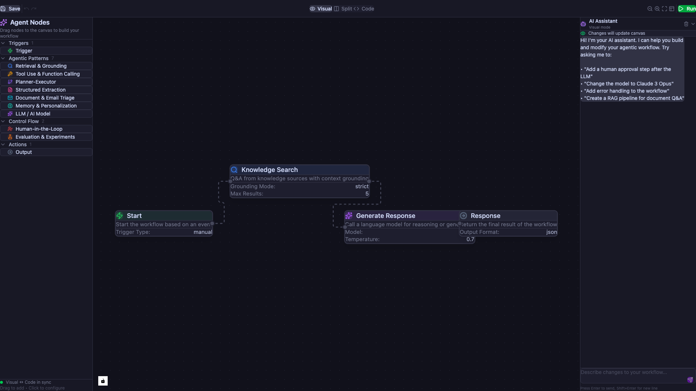
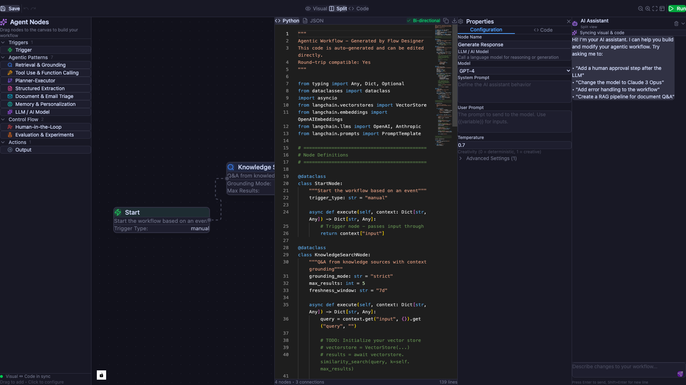
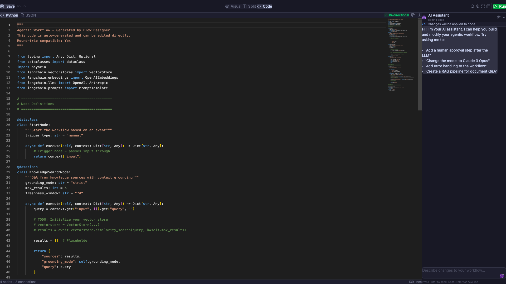
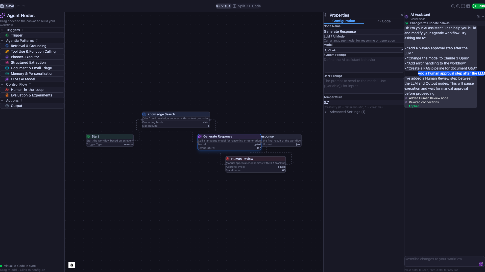
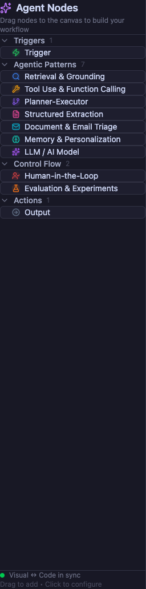
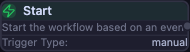
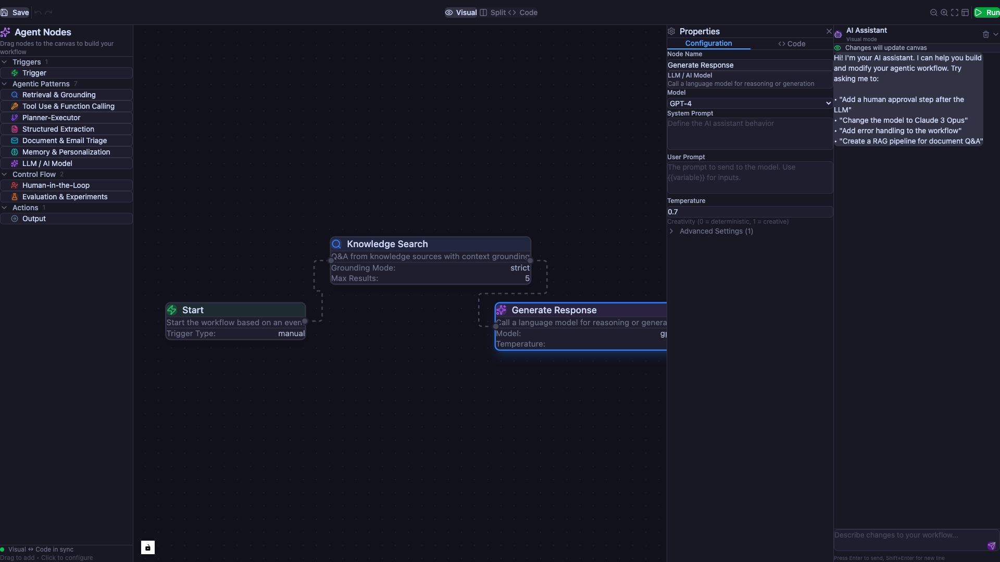
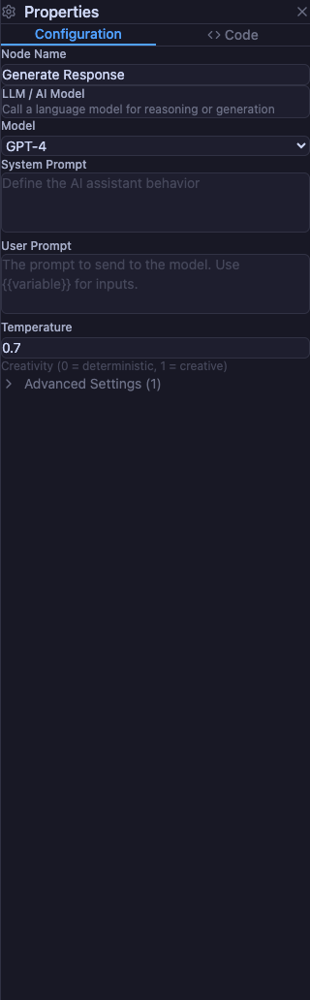

# Agentic Flow Designer

<p align="center">
  
</p>

A node-based visual designer for building agentic automations, inspired by tools like n8n, with full support for **dual authoring** between low-code visual editing and Python code.

---

## Vision & Summary

> *"To win the agentic automation era we need to embrace code as a first class artifact for automation design and runtime and offer both options to end users to meet them where they're at."*

Agentic automation/orchestration needs to support a **dual-mode view and edit** between low-code and code without needing to leave the design canvas. This project implements that vision, drawing inspiration from OpenAI Agent Builder, Lovable, and other bi-directional editing experiences.

### Core Assertions

1. **Agent building will become further democratized** across no-code and code design surfaces. We need a unified runtime between no-code and coded agents.

2. **Low code is limited in its control plane** and what developers can do with it, which results in lower reliability of the agent. Strict enforcement of low-code-only requirements will result in less reliability.

3. **Agents are building and monitoring other agents in the wild**; AI assistants (like Autopilot) need to play a concerted role in being able to introspect, generate, and compile code - whether that is represented to the end user in Python or pixels format.

---

## How It Works

<p align="center">
  
</p>

### Dual Authoring Model

The system allows full **low-code ↔ code parity**:

| Direction | How It Works |
|-----------|--------------|
| **Visual → Code** | JSON graph compiles to an opinionated Python representation (SDK conformant, framework-agnostic) |
| **Code → Visual** | Python re-hydrates to JSON only if it passes the Compilation Success Contract (CSC) - a validation process that guarantees structural integrity, schema alignment, and contract adherence |
| **Validation Fails** | A guided diff or linter explains what to fix (e.g., new dynamic tool call or schema drift), preserving trust between visual and code representations |

### Implementation Details

| Aspect | High-Level Vision | Implications |
|--------|-------------------|--------------|
| **Meaning** | Allow users to edit agents in low-code or code - either each node or the entirety of a Flow. We provide soft constraints and visual indicators when rendering back into low-code becomes impossible. | The system allows full low-code ↔ code parity with validation at each transition point. |
| **Dual Artifacts** | Each node persists as both a visual graph and a code package. Manifests and graph checksums ensure reproducibility, version integrity, and consistent round-trip conversion. | Both representations stay in sync; the visual canvas and code view are projections of the same validated AST. |
| **Schema Validation** | Use a hybrid schema validation with AST parsers; the editor maintains an AST as its source of truth, where users manipulate component nodes structurally through drag-and-drop. | Users can't create invalid hierarchies because the schema defines which children are allowed where. Each node's properties are edited through UI controls matched to their type. |
| **Edit Freedom** | In edit mode, code editing is unconstrained to preserve a natural developer experience. | If edits introduce patterns that can't round-trip, the editor indicates this rather than preventing it. |

---

## Key Principles

### 1. Code is Always Present in the Same Artifact

<p align="center">
  
</p>

Code lives alongside the visual representation - not in a separate file or export. For versioning, the option to "Clone and Convert to Code" remains available, but the primary experience keeps both in sync.

### 2. User Changes in Low-Code are Directly Translated to Code

Every drag-and-drop action, every configuration change in the properties panel, immediately updates the underlying Python code. There's no "export" step.

### 3. AI Assistant Can Modify Both Low-Code and Code

<p align="center">
  
</p>

The built-in AI assistant (Autopilot) can introspect, generate, and compile code - presenting changes to the user in either Python or visual format based on their current view mode.

### 4. Visual Cues Help Users Understand When to Go to Code

**Design-time indicators:**
- Prompt inspection reveals very explicit sequencing or hard constraints
- Lots of guardrails on the prompt or tools
- I/O Schema includes complicated nested objects/arrays

**Runtime indicators:**
- Frequent re-run with same input + high output variability
- High tool failure rate from malformed payloads (429s, 401s)
- High frequency of same tool call iterations
- High drift from runtime + online evaluations

---

## Pattern-Specific Low-Code Experiences

<p align="center">
  
</p>

> *"Writing a 2-way visualizer for python/no-code UX is not going to solve the problem of low code agents seeming like toys. It's a design problem - how do we allow users to do powerful things without being burdened by too much complexity."*

Rather than one generic canvas, the designer offers **specialized node types** for common agentic patterns. Each pattern has an "Advanced" drawer for power users, while the primary surface remains lightweight, direct, and outcome-oriented.

| Pattern | Core Use Case | UX Focus |
|---------|---------------|----------|
| **Retrieval & Grounding** | Q&A from knowledge sources | Source selection, grounding mode, freshness |
| **Tool Use & Function Calling** | Executing workflows or external APIs | Preconditions, tool policies, retries |
| **Planner-Executor** | Multi-step reasoning and actioning | Objectives, constraints, checkpoints |
| **Structured Extraction** | Schema-based extraction from docs/messages | Schema definition, precision tradeoff |
| **Document & Email Triage** | Classification and routing | Confidence thresholds, escalation |
| **Memory & Personalization** | Stateful context and recall | Retention rules, auto-write triggers |
| **Evaluation & Experiments** | Testing and benchmarking | Dataset selection, metric suite |
| **Human-in-the-Loop (HITL)** | Manual approval checkpoints | Pause points, roles, SLA definitions |

---

## When Bi-Directionality Breaks Down

<p align="center">
  
</p>

Once a user begins editing in code, certain attributes may break the low-code pattern. The editor displays **visual cues** (badges, dashed borders, or collapsed code blocks) that acknowledge the code exists without attempting to render it:

| Code Pattern | Description |
|--------------|-------------|
| **Dynamic/computed values** | Properties derived from runtime evaluation, environment variables, or function calls |
| **Complex control flow** | Conditionals, loops, or branching logic inside handlers |
| **External references** | Closures or variables defined outside the agent definition |
| **Metaprogramming** | Dynamic keys, reflection, or programmatically constructed objects |
| **Middleware/decorator chains** | Composable wrappers that modify behavior |
| **Non-declarative state transitions** | Guard functions with arbitrary logic instead of simple mappings |
| **Template literals with embedded logic** | Prompts containing conditionals or loops inside interpolations |
| **Type-level constructs** | Generics, conditional types, or TypeScript-only features |

This gives you the **structural safety of projectional editing** in the visual layer while preserving **full flexibility in code**, with honesty about when bi-directionality breaks down.

---

## Features

### Visual Canvas
- **Drag-and-drop** node placement from the sidebar
- **Connect nodes** by dragging between handles
- **Snap-to-grid** for clean layouts
- **Auto-layout** for automatic node arrangement
- **Zoom & pan** controls

### Properties Panel

<p align="center">
  
</p>

- **Configuration forms** matched to node type (enums become dropdowns, text becomes inputs, expressions open mini code editors with syntax highlighting and autocomplete)
- **Advanced settings** collapsible section
- **Per-node code overrides** with syntax highlighting
- **Validation errors** displayed inline

### Code View
- **Live Python code generation** from the visual graph
- **JSON export** for workflow serialization
- **Bi-directional sync indicator** showing round-trip compatibility
- **Monaco editor** with syntax highlighting and autocomplete

### AI Assistant

<p align="center">
  
</p>

An always-present AI assistant that interprets natural language prompts to modify your workflow:

| Prompt | Action |
|--------|--------|
| "Add a human approval step after the LLM" | Inserts Human-in-Loop node, rewires connections |
| "Change model to Claude Opus" | Updates LLM node configuration |
| "Create a RAG pipeline for document Q&A" | Generates complete 4-node workflow |
| "Add error handling with retries" | Configures exponential backoff policies |
| "Set temperature to 0.2" | Adjusts LLM creativity setting |
| "Remove the approval step" | Deletes node and reconnects workflow |

The assistant is **context-aware** and shows which authoring mode you're in (Visual/Code/Split).

---

## Governance, Observability, and Packaging

All agents emit structured telemetry for evaluation, tracing, and audit:

- **Deterministic execution modes** (seeded randomness, reproducible runs)
- **Inline evaluation metrics** and "promote to deploy" flows
- **Policy inheritance** for data and access governance

Agents are packaged as versioned `.upkg` artifacts containing both the graph and SDK code, ensuring consistent promotion through design, testing, and runtime environments.

---

## Industry Examples: Bi-Directional Editing

| Platform | Code Integration | Back to Low-Code | Constraints |
|----------|-----------------|------------------|-------------|
| **Wix Studio** | Add logic via Velo (JavaScript) | Visual editor updates automatically | Unsupported custom code may require manual binding |
| **Webflow** | Custom CSS/JS embeds | Visual structure preserved | JS/CSS outside DOM hierarchy won't render |
| **Bubble** | Plugins or JS in API connector | Full round-trip to workflow editor | Breaking schema disables visual editor temporarily |
| **Framer** | Extend with React components | Visual layers re-sync | Advanced React hooks can break layer mapping |
| **Retool** | Inline JS or SQL queries | Immediate sync in UI builder | External API logic may not visualize correctly |
| **n8n** | Custom function nodes in JS | Updates reflected in graph | External libraries prevent visual re-import |
| **Zapier** | Code by Zapier steps (JS/Python) | Preserves flow visually | Visual editor can't display internal code state |
| **KNIME** | Python/R scripts in nodes | Full sync with workflow graph | Custom nodes not following I/O schema can't render |
| **Flowise** | Export/import JSON + Python | Partial round-trip | Unsupported framework constructs drop during import |
| **Unreal Engine** | Convert or extend with C++ | Sync between Blueprints and C++ | Complex code must remain code-only |

---

## Technology Stack

- **React 19** with TypeScript
- **React Flow** (@xyflow/react) for the node-based canvas
- **Tailwind CSS v4** for styling
- **Monaco Editor** for code editing
- **Lucide React** for icons
- **Vite** for build tooling

---

## Getting Started

### Prerequisites

- Node.js 18+
- npm or yarn

### Installation

```bash
git clone https://github.com/zkeslami/agentic-flow-designer.git
cd agentic-flow-designer
npm install
```

### Development

```bash
npm run dev
```

Open [http://localhost:5173](http://localhost:5173) in your browser.

### Build

```bash
npm run build
```

---

## Project Structure

```
src/
├── components/
│   ├── AgentNode.tsx       # Custom node component
│   ├── AIAssistant.tsx     # AI chat assistant panel
│   ├── CodePanel.tsx       # Code view with Monaco editor
│   ├── PropertiesPanel.tsx # Node configuration panel
│   ├── Sidebar.tsx         # Draggable node palette
│   └── Toolbar.tsx         # Top toolbar with view controls
├── types/
│   └── index.ts            # TypeScript type definitions
├── utils/
│   ├── codeGenerator.ts    # Python/JSON code generation
│   └── nodeConfig.ts       # Node type configurations
├── App.tsx                 # Main application component
└── main.tsx                # Entry point
```

---

## Roadmap

### Phase 1 (Current)
- [x] Visual canvas with drag-and-drop
- [x] Dual view (Visual/Code/Split)
- [x] AI Assistant for natural language modifications
- [x] Properties panel with per-node configuration
- [x] Python code generation

### Phase 2
- [ ] Undo/redo functionality
- [ ] Workflow templates library
- [ ] Code → Visual parsing (full round-trip)
- [ ] Validation and linting

### Phase 3
- [ ] Real-time collaboration
- [ ] Backend runtime integration
- [ ] Deployment packaging (.upkg format)
- [ ] Evaluation metrics dashboard
- [ ] Version control for workflows

---

## Inspiration

This project draws inspiration from:

- **[n8n](https://n8n.io)** - Node-based workflow automation
- **[LangGraph](https://github.com/langchain-ai/langgraph)** - Agent orchestration framework
- **[Prefect](https://github.com/PrefectHQ/prefect)** - Workflow orchestration for data pipelines
- **[Mastra](https://github.com/mastra-ai/mastra)** - TypeScript AI application framework
- **OpenAI Agent Builder** - Dual-mode agent design
- **Lovable** - Bi-directional code/visual editing
- **Wix Studio, Webflow, Retool** - Industry patterns for visual/code parity

---

## Contributing

Contributions are welcome! Please feel free to submit a Pull Request.

---

## License

MIT License - see [LICENSE](LICENSE) for details.

---

<p align="center">
  Built with <a href="https://claude.ai/claude-code">Claude Code</a>
</p>
